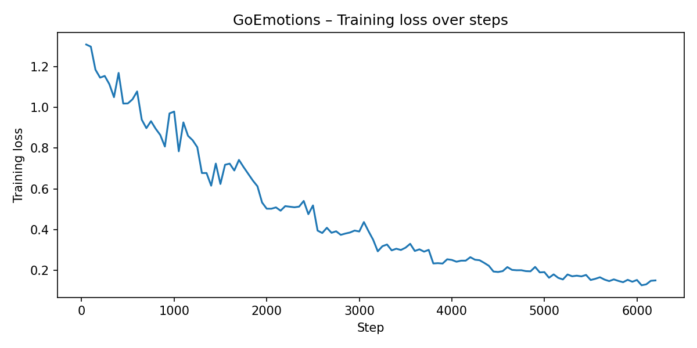
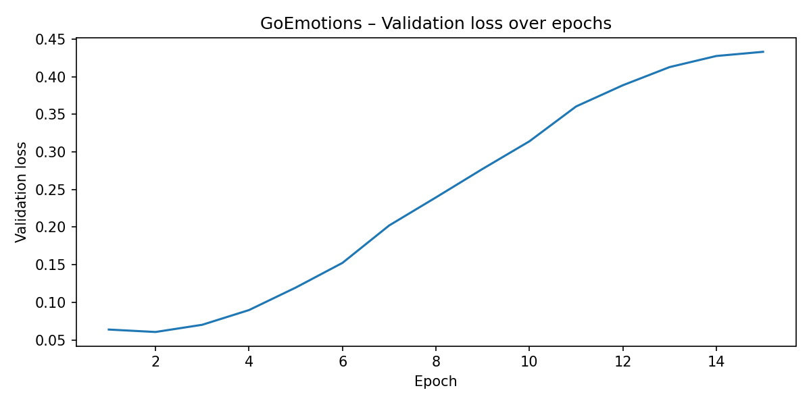
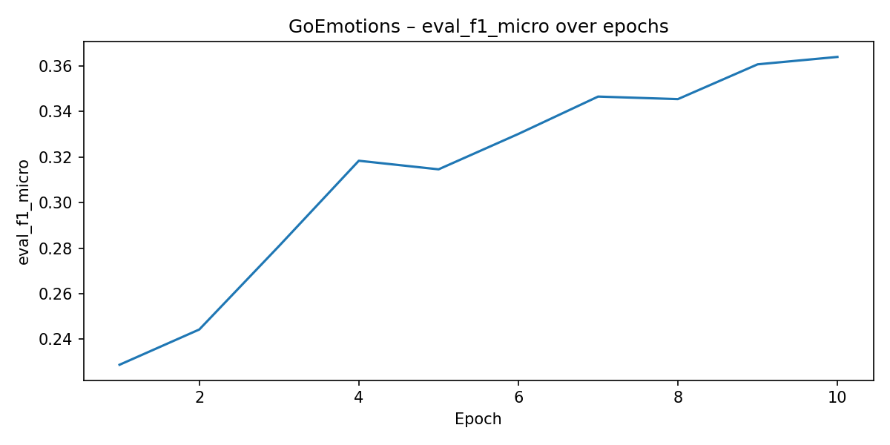
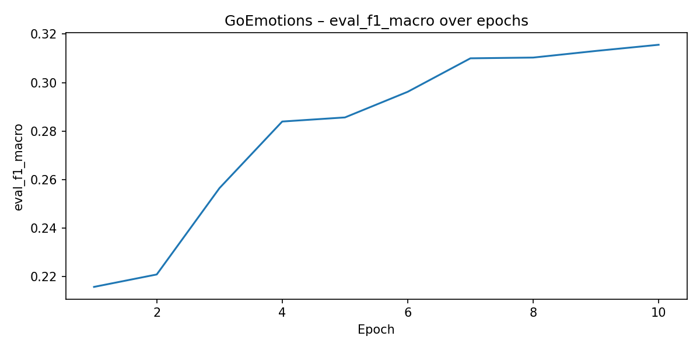

# DistilBERT-Based Emotion Profiling and Suicide Risk Detection

[](https://www.python.org/downloads/)
[](https://pytorch.org/)
[](https://huggingface.co/transformers/)
[](https://fastapi.tiangolo.com/)
[](LICENSE)

## Abstract

This study implements DistilBERT-based models for two distinct mental health classification tasks: multi-label emotion profiling on the GoEmotions dataset (29 categories) and binary suicide risk detection on the SuicideWatch dataset. The implementation incorporates Focal Loss to address class imbalance, class-specific threshold optimization for multi-label predictions, and stratified 40/10/50 train/validation/test splits. Models achieve 39.24% F1-micro (with optimized thresholds) on GoEmotions and 97.07% accuracy on SuicideWatch validation sets. The study includes model compression via 30% pruning and INT8 quantization for efficient deployment, with a FastAPI service providing REST endpoints for real-time inference.

## Table of Contents
- [Architecture Overview](#architecture-overview)
- [Datasets](#datasets)
- [Methodology](#methodology)
- [Experimental Setup](#experimental-setup)
- [Results](#results)
- [Model Compression](#model-compression-and-deployment)
- [Installation & Usage](#installation--usage)
- [API Documentation](#api-documentation)
- [Reproduction](#reproduction-checklist)
- [Ethical Considerations](#ethical-considerations)
- [Citation](#citation)

## Repository Overview

```
.
├── Data/
│   ├── go_emotions_dataset.csv
│   └── Suicide_Detection.csv
├── distilbert-emotion-suicide-risk-improved.ipynb
├── app/
│   └── main.py
├── model_go/
│   ├── config.json
│   ├── model.safetensors
│   ├── optimal_thresholds.npy
│   ├── model_go_pruned.pt
│   ├── model_go_pruned_quantized.pt
│   └── ...
├── model_sw/
│   ├── config.json
│   ├── model.safetensors
│   ├── model_sw_pruned.pt
│   ├── model_sw_pruned_quantized.pt
│   └── ...
└── visuals/
    └── training curves + evaluation plots (PNG)
```

## Datasets

- **GoEmotions** (Google/Pushshift): 211,225 Reddit comments annotated with 28 fine-grained emotions and `neutral`. After filtering `example_very_unclear` entries and removing samples without positive emotion labels, the dataset is split using iterative stratified sampling into 83,150 training / 20,787 validation / 103,877 test samples (40/10/50 split). Download: <https://www.kaggle.com/datasets/shivamb/go-emotions-google-emotions-dataset>.
- **SuicideWatch** (Nikhileswar Komati): 232,074 Reddit posts labeled as `suicide` or `non-suicide`. The dataset is stratified into 92,829 training / 23,208 validation / 116,037 test samples (40/10/50 split). Class distribution is balanced at approximately 50/50. Download: <https://www.kaggle.com/datasets/nikhileswarkomati/suicide-watch>.

> Both corpora contain sensitive mental-health disclosures. Respect Kaggle licensing terms and handle all text responsibly.

### Dataset Snapshot

| Dataset | Rows × Cols | Key Columns | Notes |
| --- | --- | --- | --- |
| GoEmotions | 211 225 × 31 | `id`, `text`, `example_very_unclear`, 28 emotion indicators, `neutral` | 48.5 MB, boolean clarity flag + dense integer labels |
| SuicideWatch | 232 074 × 3 | `text`, `class` (`suicide` / `non-suicide`) | 5.3 MB, includes `Unnamed: 0` index column from Kaggle export |


### Emotion Label Distribution (83k GoEmotions Training Split)

| Label | Samples | Label | Samples |
| --- | --- | --- | --- |
| grief | 270 | disgust | 2,120 |
| relief | 515 | surprise | 2,206 |
| pride | 521 | excitement | 2,252 |
| nervousness | 724 | caring | 2,399 |
| embarrassment | 990 | sadness | 2,703 |
| remorse | 1,010 | confusion | 2,944 |
| fear | 1,279 | joy | 3,194 |
| desire | 1,527 | anger | 3,234 |
| love | 3,277 | gratitude | 4,645 |
| disappointment | 3,388 | annoyance | 5,441 |
| optimism | 3,486 | admiration | 6,846 |
| realization | 3,514 | approval | 7,044 |
| amusement | 3,699 | neutral | 22,104 |
| curiosity | 3,873 | — | — |

## Methodology

### Data Preprocessing
- **GoEmotions:** Remove `example_very_unclear` entries, discard samples without positive emotion labels, apply iterative multi-label stratification (`skmultilearn`) for 40/10/50 train/validation/test split
- **SuicideWatch:** Lowercase and strip text, remap string labels to binary (0/1), stratified 40/10/50 split maintaining class balance

### Model Architecture
- **Base Model:** DistilBERT-base-uncased for both tasks
- **GoEmotions:** Multi-label classification head (`problem_type="multi_label_classification"`) with 29 output neurons
- **SuicideWatch:** Binary classification head with 2 output neurons

### Training Configuration
- **Loss Functions:**
  - GoEmotions: Focal Loss (α=0.25, γ=2.0) with per-class positive weights
  - SuicideWatch: Binary Focal Loss (α=0.25, γ=2.0) with label smoothing (0.1)
- **Optimization:** AdamW with cosine learning rate scheduling, 10% warmup (SuicideWatch only)
- **Training:** Mixed precision (FP16), batch size 8, automatic early stopping with `load_best_model_at_end=True`
- **Epochs:** 15 for GoEmotions (best model selected based on validation F1-macro), 8 for SuicideWatch (training stopped early at epoch 5 due to validation F1 plateau)

### Threshold Optimization
- **GoEmotions only:** Post-training class-specific threshold tuning on validation set
- Thresholds optimized per emotion to maximize per-class F1-scores
- Range: 0.35 (relief) to 0.80 (fear, gratitude)

### Evaluation Metrics
- **GoEmotions:** Hamming score, micro/macro F1, micro precision/recall
- **SuicideWatch:** Accuracy, F1-score, precision, recall

## Architecture Overview

The study relies on DistilBERT's compressed Transformer backbone, which halves the number of layers relative to BERT-Base while retaining most of its representational capacity. The schematic below illustrates how the student network inherits the teacher's embeddings, multi-head attention, and feed-forward stacks, making it well-suited for efficient fine-tuning on safety-critical NLP tasks.

<div align="center">
  
  <p><i>Figure 1: Comparison of BERT-Base and DistilBERT architectures. DistilBERT reduces model size by 40% while retaining 97% of BERT's performance.</i></p>
</div>

## Experimental Setup

- **Hardware:** Tesla T4 GPU (Kaggle environment); automatic CPU fallback when GPU unavailable
- **Tokenization:** 
  - GoEmotions: max length 128 tokens
  - SuicideWatch: max length 256 tokens
  - Static padding for efficient batching
- **Training Configuration:**
  - Batch size: 8 (both tasks)
  - GoEmotions: 15 epochs, logging every 50 steps
  - SuicideWatch: 8 epochs configured (training stopped early at epoch 5), logging every 100 steps
  - Evaluation strategy: per epoch
  - Model selection: best validation F1-macro (GoEmotions), best validation F1 (SuicideWatch)
  - Early stopping: automatic via `load_best_model_at_end=True`, loads best checkpoint at training completion
- **Output Artifacts:** Checkpoints saved to `model_go/` and `model_sw/`, training curves saved to `visuals/`, logs written to `logs_go/` and `logs_sw/`

## Results

### Quantitative Performance

**GoEmotions (Validation Set, Best Epoch from 15)**

| Threshold Strategy | Hamming Score | F1-Micro | F1-Macro | Precision (Micro) | Recall (Micro) |
| --- | --- | --- | --- | --- | --- |
| Fixed (0.5) | 0.3218 | 0.3737 | 0.3290 | 0.2791 | 0.5651 |
| Optimized (per-class) | **0.3433** | **0.3924** | **0.3426** | 0.2791 | 0.5651 |
| **Improvement** | **+2.15%** | **+1.88%** | **+1.36%** | — | — |

**SuicideWatch (Validation Set, Best Epoch 5)**

| Metric | Score |
| --- | --- |
| Accuracy | **97.07%** |
| F1-Score | **97.07%** |
| Precision | **97.35%** |
| Recall | **96.79%** |

> **Note:** SuicideWatch training was configured for 8 epochs but automatically stopped at epoch 5 due to validation F1 plateauing. The best model checkpoint (epoch 4-5) was automatically loaded via `load_best_model_at_end=True`.

### Training Curves

The training process demonstrates stable convergence for both tasks with minimal overfitting:

<div align="center">
  
  
  <p><i>Figure 2: GoEmotions training (left) and validation (right) loss curves over 10 epochs.</i></p>
</div>

<div align="center">
  
  
  <p><i>Figure 3: GoEmotions F1 scores (micro and macro) showing steady improvement across epochs.</i></p>
</div>

<div align="center">
## Installation & Usage

### Prerequisites

- Python 3.10 or higher
- 2GB disk space (models not included in repository)
- (Optional) CUDA-capable GPU for training

### Quick Start

```bash
# Clone the repository
git clone https://github.com/BaidarSamir/Emotion-Profiling-and-Suicide-Risk-Detection.git
cd Emotion-Profiling-and-Suicide-Risk-Detection

# Create virtual environment
python -m venv venv
source venv/bin/activate  # On Windows: .\venv\Scripts\Activate.ps1

# Install dependencies
pip install -r requirements.txt
```

### Option 1: Train Models from Scratch

Run the Jupyter notebook to train both models (requires datasets):

```bash
# Install training dependencies
pip install jupyter matplotlib scikit-learn scikit-multilearn gdown

# Launch Jupyter
jupyter notebook distilbert-emotion-suicide-risk-improved.ipynb
```

The notebook will:
1. Download GoEmotions and SuicideWatch datasets (or use local files from `Data/`)
2. Apply stratified 40/10/50 splits with iterative multi-label stratification
3. Train both DistilBERT models with Focal Loss:
   - GoEmotions: 83,150 training samples, 10 epochs
   - SuicideWatch: 92,829 training samples, 8 epochs
4. Perform threshold optimization for GoEmotions (29 class-specific thresholds)
5. Generate evaluation metrics and visualizations
6. Save models to `model_go/` and `model_sw/`
7. Create pruned (30%) and quantized (INT8) versions for deployment

**Training time**: ~2.5 hours for GoEmotions + ~2.5 hours for SuicideWatch on Tesla T4 GPU

### Option 2: Use Pre-trained Models

Download pre-trained models from [Releases](#) (coming soon) and extract to project root:
- `model_go.zip` → extract to `model_go/`
- `model_sw.zip` → extract to `model_sw/`

### Start the API Server

```bash
# Ensure models exist in model_go/ and model_sw/
uvicorn app.main:app --reload
```

The server will be available at:
- **API**: `http://localhost:8000`
- **Interactive Docs**: `http://localhost:8000/docs`
- **Alternative Docs**: `http://localhost:8000/redoc`

## API Documentation

### Endpoints

#### Health Check
```bash
GET /healthz
```
Returns server status and device information (CPU/GPU).

#### Emotion Profiling
```bash
POST /predict/emotions
Content-Type: application/json

{
  "text": "I am hopeful yet anxious about the future.",
  "threshold": 0.5
}
```

**Response:**
```json
{
  "threshold": 0.5,
  "predictions": [
    {"label": "optimism", "probability": 0.7234},
    {"label": "nervousness", "probability": 0.6891}
  ],
  "full_distribution": [...]
}
```

#### Suicide Risk Detection
```bash
## Ethical Considerations

**Critical Safety Notice**: These models are research tools designed to augment, never replace, trained mental health professionals. 

### Deployment Guidelines

- ✅ **DO**: Use as an initial screening tool to identify at-risk content
- ✅ **DO**: Implement human-in-the-loop review for all high-risk classifications
- ✅ **DO**: Provide immediate access to crisis resources (e.g., 988 Suicide & Crisis Lifeline)
- ✅ **DO**: Maintain strict user privacy and obtain informed consent
- ✅ **DO**: Monitor for bias and regularly audit model performance across demographics

- ❌ **DON'T**: Make automated decisions without human oversight
- ❌ **DON'T**: Use as a diagnostic tool or replacement for clinical assessment
- ❌ **DON'T**: Deploy without proper crisis intervention protocols
- ❌ **DON'T**: Share user data without explicit consent

### Crisis Resources

- **US**: 988 Suicide & Crisis Lifeline | Text HOME to 741741
- **International**: https://www.iasp.info/resources/Crisis_Centres/

### Limitations

1. **Class Imbalance**: GoEmotions exhibits long-tail distribution (rare emotions have limited training samples)
2. **Cultural Context**: Models trained on English Reddit data may not generalize across languages or cultural contexts
3. **Temporal Drift**: Mental health language evolves; models require periodic retraining
4. **False Negatives**: High precision may sacrifice recall; some at-risk individuals may not be flagged

## Future Directions

1. **Test Set Evaluation**: Conduct comprehensive evaluation on held-out test sets (103,877 GoEmotions samples, 116,037 SuicideWatch samples) to validate generalization
2. **Class-Balanced Sampling**: Apply oversampling or focal loss weight adjustments to improve performance on rare emotion classes (grief, relief, pride)
3. **Multilingual Extension**: Fine-tune models on non-English mental health corpora for broader applicability
4. **Temporal Context**: Incorporate conversation history or user posting patterns for longitudinal risk assessment
5. **Model Interpretability**: Integrate attention visualization, LIME, or SHAP for explainable predictions in clinical settings
6. **Probability Calibration**: Apply temperature scaling or Platt scaling to improve confidence estimation reliability

## Citation

If you use this work in your research, please cite:

```bibtex
@misc{baidar2025emotion,
  author = {Baidar, Samir},
  title = {DistilBERT-Based Emotion Profiling and Suicide Risk Detection},
  year = {2025},
  publisher = {GitHub},
  url = {https://github.com/BaidarSamir/Emotion-Profiling-and-Suicide-Risk-Detection}
}
```

### Dataset Citations

**GoEmotions**:
```bibtex
@inproceedings{demszky2020goemotions,
  title={GoEmotions: A Dataset of Fine-Grained Emotions},
  author={Demszky, Dorottya and Movshovitz-Attias, Dana and Ko, Jeongwoo and Cowen, Alan and Nemade, Gaurav and Ravi, Sujith},
  booktitle={Proceedings of the 58th Annual Meeting of the Association for Computational Linguistics},
  year={2020}
}
```

**SuicideWatch**:
```bibtex
@misc{komati2021suicidewatch,
  author = {Komati, Nikhileswar},
  title = {Suicide Watch Dataset},
  year = {2021},
  publisher = {Kaggle},
  url = {https://www.kaggle.com/datasets/nikhileswarkomati/suicide-watch}
}
```

## License

This project is licensed under the MIT License - see the [LICENSE](LICENSE) file for details.

## Acknowledgments

- Hugging Face for the Transformers library and DistilBERT implementation
- Google Research for the GoEmotions dataset
- Reddit communities for providing the training data
- FastAPI team for the excellent web framework

## Repository Structure

```
Emotion-Profiling-and-Suicide-Risk-Detection/
├── app/
│   └── main.py                          # FastAPI application with inference endpoints
├── visuals/                             # Training curves and evaluation plots
│   ├── go_train_loss.png
│   ├── go_val_loss.png
│   ├── go_eval_f1_micro.png
│   ├── go_eval_f1_macro.png
│   ├── go_eval_hamming_score.png
│   ├── sw_train_loss.png
│   ├── sw_val_loss.png
│   ├── sw_eval_accuracy.png
│   ├── sw_eval_f1.png
│   ├── sw_eval_precision.png
│   └── sw_eval_recall.png
├── distilbert-emotion-suicide-risk-improved.ipynb  # Improved training notebook with Focal Loss
├── distilbert-emotion-suicide-risk.ipynb  # Baseline training notebook (deprecated)
├── Diagram_of_BERT_BASE_and_Distil_BERT_model_architecture_facb5e7639.png
├── Test.png                             # API testing screenshot
├── requirements.txt                     # Python dependencies
├── README.md                            # This file
├── LICENSE                              # MIT License
├── .gitignore                           # Git ignore patterns
├── model_go/                            # GoEmotions model (not in repo - train or download)
└── model_sw/                            # SuicideWatch model (not in repo - train or download)
```

**Note**: Model directories (`model_go/`, `model_sw/`) and datasets (`Data/`) are excluded from the repository due to size constraints. Please train models using the notebook or download pre-trained versions.

## Contact

For questions, issues, or collaboration opportunities:
- **GitHub Issues**: [Create an issue](https://github.com/BaidarSamir/Emotion-Profiling-and-Suicide-Risk-Detection/issues)
- **Repository**: [BaidarSamir/Emotion-Profiling-and-Suicide-Risk-Detection](https://github.com/BaidarSamir/Emotion-Profiling-and-Suicide-Risk-Detection)

## Contributing

Contributions are welcome! Please:
1. Fork the repository
2. Create a feature branch (`git checkout -b feature/AmazingFeature`)
3. Commit your changes (`git commit -m 'Add AmazingFeature'`)
4. Push to the branch (`git push origin feature/AmazingFeature`)
5. Open a Pull Request

---

<div align="center">
  <p><b>⚠️ If you or someone you know is in crisis, please reach out for help immediately.</b></p>
  <p><b>US: Call/Text 988 | International: https://www.iasp.info/resources/Crisis_Centres/</b></p>
</div>
}
```

**Response:**
```json
{
  "label": "suicide",
  "confidence": 0.9234,
  "probabilities": {
    "non-suicide": 0.0766,
    "suicide": 0.9234
  }
}
```

### Python Client Example

```python
import requests

# Emotion analysis
response = requests.post(
    "http://localhost:8000/predict/emotions",
    json={"text": "I feel wonderful today!", "threshold": 0.5}
)
emotions = response.json()
print(f"Detected emotions: {[p['label'] for p in emotions['predictions']]}")

# Suicide risk assessment
response = requests.post(
    "http://localhost:8000/predict/suicide",
    json={"text": "I'm feeling stressed but managing."}
)
risk = response.json()
print(f"Risk level: {risk['label']} (confidence: {risk['confidence']:.2%})")
```

### Direct Model Inference

```python
import torch
from transformers import AutoTokenizer, AutoModelForSequenceClassification

# Load model and tokenizer
tokenizer = AutoTokenizer.from_pretrained("./model_sw")
model = AutoModelForSequenceClassification.from_pretrained("./model_sw")
model.eval()

# For CPU deployment, use quantized version:
# model = torch.load("model_sw/model_sw_pruned_quantized.pt")

# Inference
text = "I can't stop thinking about hurting myself."
inputs = tokenizer(text, return_tensors="pt", truncation=True, padding=True)

with torch.no_grad():
    logits = model(**inputs).logits
    probabilities = torch.softmax(logits, dim=-1)
    
risk_score = probabilities[0, 1].item()  # Index 1 = "suicide"
print(f"Risk probability: {risk_score:.3f}")
```

For multi-label emotion classification, apply sigmoid activation:
```python
model_go = AutoModelForSequenceClassification.from_pretrained("./model_go")
logits = model_go(**inputs).logits
probabilities = torch.sigmoid(logits)  # Multi-label: sigmoid instead of softmax
```
# Suicide risk probability
curl -X POST http://localhost:8000/predict/suicide \
     -H "Content-Type: application/json" \
     -d '{"text":"I dont want to be here anymore."}'
```

Responses contain the probability distribution across all labels so downstream systems can build custom decision policies.

### Example Inference

```python
import torch
from transformers import AutoTokenizer, AutoModelForSequenceClassification

tokenizer = AutoTokenizer.from_pretrained("distilbert-base-uncased")
model = torch.load("model_sw/model_sw_pruned_quantized.pt")
model.eval()

inputs = tokenizer(
    "I can't stop thinking about hurting myself.",
    return_tensors="pt",
    truncation=True,
    padding=True
)
with torch.no_grad():
    logits = model(**inputs).logits
prob_suicide = torch.softmax(logits, dim=-1)[0, 1].item()
print(f"Risk probability: {prob_suicide:.3f}")
```

Use the GoEmotions checkpoint with a sigmoid activation to obtain 29 probability scores and adjust decision thresholds per label if required.

## Reproduction Checklist

1. Create a virtual environment (Python ≥ 3.10) and install dependencies:
   ```bash
   pip install torch transformers scikit-learn scikit-multilearn pandas numpy jupyter matplotlib
   ```
2. Place the Kaggle CSVs in `Data/` or let the notebook download them automatically via `gdown`
3. Launch Jupyter and run `distilbert-emotion-suicide-risk-improved.ipynb` sequentially
4. For Kaggle execution: notebook auto-detects `/kaggle/input` paths
5. For local execution: notebook downloads datasets to `Data/` and saves outputs to local directories

## Ethical Considerations

These models analyze text about self-harm and should only augment, never replace, trained professionals. Deployments must incorporate human-in-the-loop review, clear escalation policies, and guardrails against misuse. Maintain user privacy and obtain all necessary approvals before processing sensitive content.

## Future Directions

1. Increase GoEmotions coverage (larger training subset or class-balanced sampling) to improve macro-level recall.
2. Integrate experiment tracking (Weights & Biases, MLflow) for hyper-parameter sweeps.
3. Wrap the quantized checkpoints in a FastAPI/Gradio service with confidence calibration and explanation tooling.
